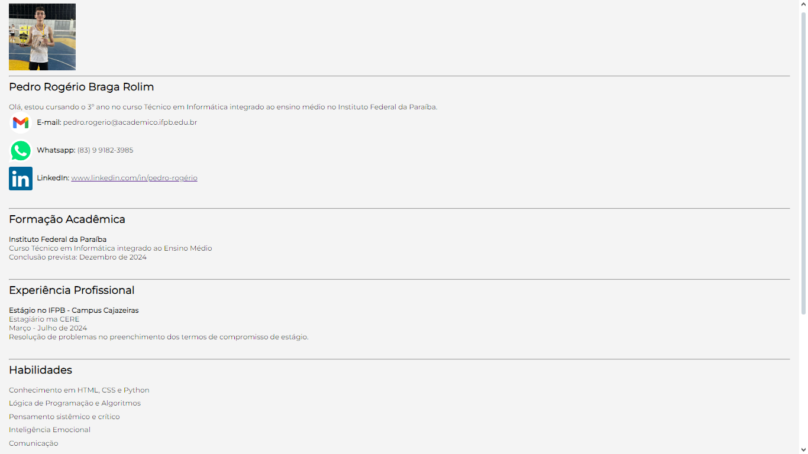

# Currículo Pessoal

Este projeto consiste em um **currículo pessoal** desenvolvido com **HTML** e **CSS** como parte de uma atividade avaliativa. O currículo é responsivo e apresenta minhas informações profissionais e acadêmicas de forma organizada e estilizada.

## Estrutura de Arquivos
curriculo-pessoal
- ┣ img
- ┃ ┣ WhatsApp.png
- ┃ ┣ icon.png
- ┃ ┣ linkedin.png
- ┃ ┣ mail.png
- ┃ ┗ perfil.png
- ┣ README.md
- ┣ index.html
- ┗ styles.css

## Pré Visualização

